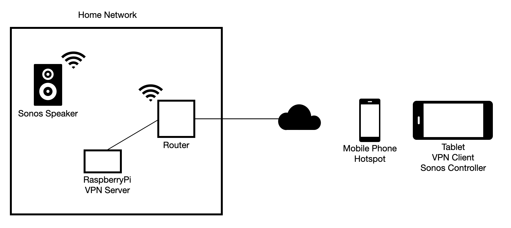

# Sonos over VPN

This project describes how to remotely access and control your Sonos speakers using the app over a VPN 
connection into your home network. The final build looks like this:

These instructions assume that you run a very simple network with just your ISP provided router on your local
network. If you're doing something more advanced, the details below will be different.

See below for the challenges that need to be overcome. 

Instructions for setting up the vpn server and networking are [here](docs/server-and-networking.md)
Instructions for setting up clients are [here](docs/client-setup.md)

## Challenges

There are three challenges to overcome to get this to work:

* the app only works on wifi networks
* the multicast service discovery protocol doesn't cross network boundaries
* return traffic from the speakers to the app use the app's VPN IP address

The build and operational instructions below address all these issues.

Once the app has discovered the speakers and the speakers know about the app, the traffic seems to be
unicast traffic and it all works smoothly... it's the discovery and setting up the initial connection
that has special challenges.

### Challenge #1: Wifi Network

The app checks if your device is on a wifi network, and if it isn't, then it refuses to operate.

The way I use it is, as shown in the diagram above, to setup a hotspot on my mobile phone and then connect 
my tablet to it and start the VPN on my tablet. When that's all up, I can start the Sonos app and control 
the speakers.

### Challenge #2: Multicast Service Discovery 

Multicast packets aren't normally forwarded by routers (in this case, the RaspberryPi VPN server) which 
means that by default, the discovery packets arriving at your VPN server will be dropped and never make it 
into your home network to find your sonos speakers.

This is solved with these two steps:

* incrementing the multicast packet TTL so it can be forwarded into the home network
* installing a multicast router on the VPN server to do the forwarding

An 'iptables' rule (in the 'mangle' table) is installed to increment the packet TTL. If you were to install
the rule manually, the command would look something like this:

    iptables -t mangle -A POSTROUTING -o eth0 -j TTL --ttl-inc 1

The ansible scripts install the multicast router 'pimd' on the vpn server to forward the packets. 
It works with the default installation and configuration.

These two steps are handled automatically by the ansible setup.

### Challenge #3: Return Traffic to App Host's VPN IP Address

It appears that the multicast service discovery protocol being used sends the IP address and port of 
the device running the app as part of the packet payload. This means the speakers always want to talk 
back to the app on it's actual VPN IP address.

There are two consequences of this:

* can't have NAT anywhere between the app and the speakers
* the speakers need to be able to route traffic back to the VPN network

There are a number of ways to make this work and they are things you will need to do manually. The approach
documented below uses static routes on your ISP provided router.

